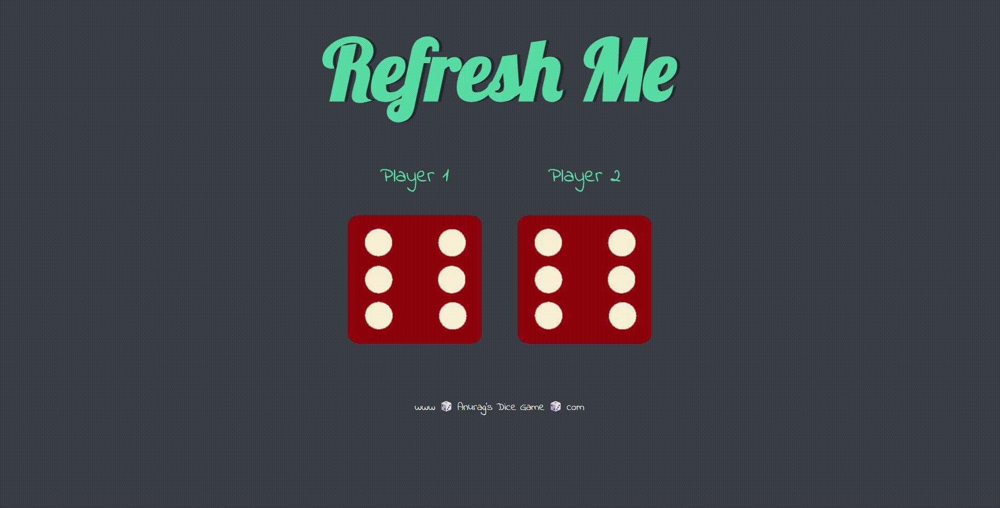

# Dice Game

A simple and engaging web-based dice game where two players roll dice and the higher roll wins! Refresh the page to play again.

## 🚀 Live Demo

[https://anurag2118.github.io/Dice-Game/](https://anurag2118.github.io/Dice-Game/)

## ▶️ Gameplay Demo



## 🎲 How to Play

1.  **Open `index.html`** in your web browser (or simply visit the [Live Demo](https://anurag2118.github.io/Dice-Game/)).
2.  **Refresh the page!** Each time you refresh, Player 1 and Player 2 will roll their dice.
3.  **See the Winner:** The title at the top will instantly declare the winner (Player 1, Player 2, or a Draw!).

## ✨ Features

* **Random Dice Rolls:** Utilizes JavaScript's `Math.random()` to generate unpredictable dice outcomes.
* **Dynamic Image Updates:** Dice images change based on the random roll.
* **Clear Winner Declaration:** The game title updates to announce the winner or a draw.
* **Simple Refresh-to-Play:** Designed for quick and easy replays by simply refreshing the browser.

## 🛠️ Technologies Used

* HTML5
* CSS3
* JavaScript

## 🚀 Getting Started

To get a local copy up and running, follow these simple steps:

1.  **Clone the repository:**
    ```bash
    git clone [https://github.com/anurag2118/Dice-Game.git](https://github.com/anurag2118/Dice-Game.git)
    ```
2.  **Navigate to the project directory:**
    ```bash
    cd Dice-Game
    ```
3.  **Open `index.html`** in your preferred web browser.

## Project Link

[https://github.com/anurag2118/Dice-Game](https://github.com/anurag2118/Dice-Game)
